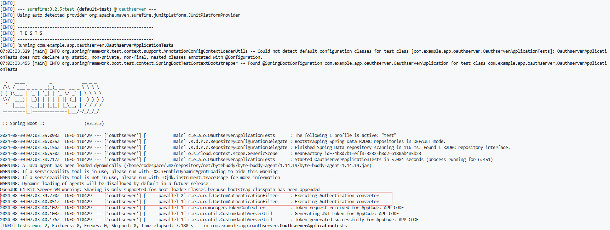

# Oauth Server 

A simple project to demonstrate a custom OAuth server that generates a JWT token using Spring Security.

This repository is created to demonstrate an issue and understand why the Spring Security filter is being called twice.



[](https://github.com/codespaces/new?hide_repo_select=true&repo=samuelj90/auth-filter-issue&ref=main)


## Getting Started

### Prerequisites

- Java 17 or higher
- Maven 3.6.3 or higher

### Test 

To run the tests, use the following command:
```sh
mvn test
```

## Directory Structure

- src/main/java/com/example/app/oauthserver/: Contains the main application code
- config/: Configuration classe.
- entity/: Entity classs.
- filter/: Spring Security Filter clases.
- manager/: Authentication Manager classes and Token Controller cass.
- model/: Model clsses.
- repository/: Repository intefaces.
- src/main/resources/: Contains the main application proerties.
- src/test/java/com/example/app/oauthserver/: Contains the test code.
- src/test/resources/: Contains test resources like properties and SQL files.